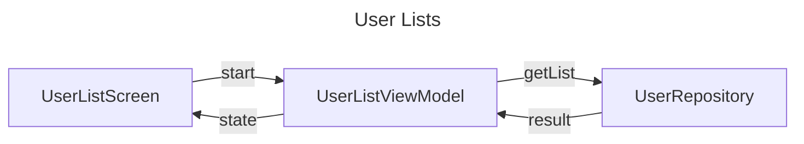
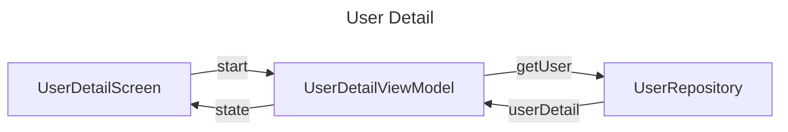

# Android-Compose-Github-Users-Client
Android compose practice project

MVVM architecture + coroutine Flow

unit tests included in src/tests

## ScreenShots

## Functions
#### List github users
    1. When app starts, start get users list from github listUser API 
    2. show loading UI on screen
    3. if API result is success then show user list UI on screen
       otherwise show error UI on screen

#### Get github user details
    1. user click a github user in UserList UI
    2. start get user detail data from github user API
    3. show Loading UI on screen
    4. if API result is success then show user detail UI on screen
        otherwise show error UI on screen
## Libraries
+ Android Compose: display ui
+ compose navigation: navigate between screens
+ retrofit: make http(s) request 
+ Kotlin coroutine: llows easily use of asynchronous or non-blocking operations
+ Kotlin serialization: deserialize models from backend
+ coil: asynchronous image loading library
+ koin: dependency injection tools

## Flow

---

## Github action release 
push git tag v* will create a release version automatically by github actoins

### Future improvements
- login
- follow users
- list load more
